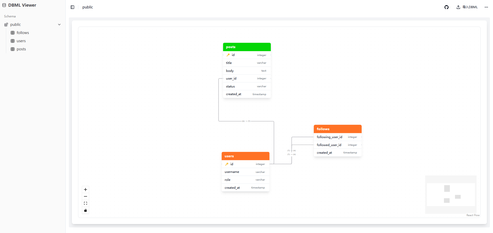

# DBML Viewer

一个用于预览DBML（Database Markup Language）的Web应用工具。

## 主要功能

- DBML图表的动态渲染和预览
- 图表缩放控制（放大/缩小）
- 可查看单个表的结构，也可查看整个数据库的结构
- 简单易用，无需安装，直接在线使用
- 不保存用户数据，所有内容均在浏览器本地存储
- 提供GitHub源码链接

## 技术栈

- React
- TypeScript
- Vite
- Tailwind CSS
- React Router DOM
- React Flow
